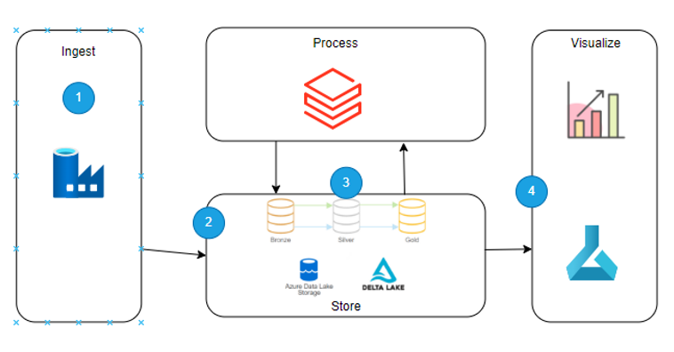

## Vacation home business Data Platform: Case Study 
Data Platform design and implantation for vacation home data analysis

### Business Wish
To identify the market trends from the AirBnb data, to optimize their processes  and highlight the pain points.

### Data Platform

Microsoft Azure is the preferred cloud provider as it provides most of the data analytics and transformation services natively. moreover scalability and high availability options are there.
The diagram below shows the basic architecture of the data platform.

#### Production Approach
* In a production environment where source files can be onboarded with different frequencies and from different sources, DataFactory can onboard and integrate different data sources. 
* Depending on whether it's a pull or a push mechanism in Data lake container, different strategies can be optimized.

* Once the data is inside Azure premises, local services can use it without additional approvals. DataBricks can be chosen as a transformation engine as it has enterprise scale compute power along with Git and notebook support, where **jobs can be scheduled** and insights can be generated. 

* Since the intermediate and final dataset is going to be on Azure it can easily be utilized for different usecases such as machine learning and power bi for dashboard and reporting.

* Orchestrator notebook can be run on daily basis along with the DataFactory pipeline for data onboarding.<br>
  *Ingestion Pipeline on DataFactory (onboards new data)*
==>> *Orchestration notebook on DataBricks to update the data in the tables*<br>

### Project code
It resides in the orchestrator notebook, which has below functions :
**For complete code kindly refer the [a link] Orchestration.py
```python
def orch():
  status = ""
  execution_log = ""
  try:
    create_database = create_database()
    if all([create_database[0] == 'success']):
      try:
            create_bronze_table = bronze_table_creation()
            create_silver_tables = create_silver_tables()
            listing= update_listing()
            neighbourhood = update_neighbourhood()
            reviews = update_reviews()
            listing_dates = update_ListingDates()
            if all([create_bronze_table[0] == create_silver_tables[0] == listing[0] == neighbourhood [0] == reviews[0] == listing_dates[0] == 'success']):
              status = 'success'
              execution_log = "bronze and silver table creation succeeded "
      except Exception as e:
        status = 'failed'
        execution_log = f"bronze and/or silver table creation failed, check log here {e} "
    else:
      status = 'failed'
      execution_log = f'Database creation failed'    
  except Exception as execution_error:
      status = 'failed'
      execution_log = f"orchestrator failed -- Kindly check the log here {execution_error}"

## initiating orchestrator
orch_exe = orch()
print(orch_exe)

```


### Additional Actions 
* Additional Data Quality checks can be implemented at Silver layer tables, which will make sure business can be aware of data quality rules and can be assured of the correct data getting to the gold layer.
* Depending on use case more gold layer datasets can be introduced.
* References can found out at the end of the presentation.

======================================================
